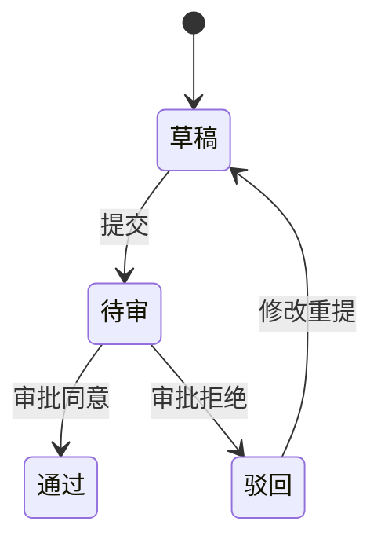

# 功能 SPEC（从 PRD 派生）

从功能 PRD 派生功能 SPEC（字段验收说明）。SPEC 是开发 / QA / Claude pipeline 实际拿来干活的文档——包含 schema、接口、状态机、异常路径、权限、非功能需求、AI 特有元素。客户合同效力由阶段需求确认单（指针式：commit hash + 版本号 + 条目编号 + 不做什么）锁定，SPEC.md 本身不签字，作为 hash 可反查的客观底稿存在。

<HARD-GATE>
**不能从零写 SPEC**。必须先有 Feature PRD 作为输入（write-spec 产出的 .md 文件）。如果用户没指定 PRD 路径，先让用户给出来，**不要自己编造业务背景**。
</HARD-GATE>

## 反模式："这 Feature 太简单不需要 SPEC"

每个 Feature 都过这个流程。**简单 Feature 也要 SPEC**——不是因为复杂，是因为**避免版本地狱**。简单 Feature 的 SPEC 可以很短（几个字段表 + AC），但必须存在，否则后续技术细节变更没地方挂。"这 Feature 简单到不用 SPEC"是 ToB 项目变更管理崩盘的高发起点。

## 关键约束（设计原则）

1. **PRD 是 source of truth**——每次 derive-spec 跑都重新读 PRD，不引用 SPEC 旧版
2. **SPEC 内部迭代不反向修改 PRD**——除非业务方向变了，那时由 PM 重新跑 write-spec
3. **SPEC.md frontmatter 写明对应 PRD 路径 + 版本号**——追溯链不能断
4. **1 PRD → 1 SPEC**（单数）——SPEC 颗粒度 = Feature 颗粒度，跨 Feature 内容不混进同一个 SPEC

## 9 步 Checklist

按顺序执行，**每步都创建 task**：

1. **读功能 PRD** —— 用户提供 PRD 路径，Read 整文件，抽取 Goals / Non-Goals / User Stories / Requirements
2. ~~视觉伴侣~~（删除——SPEC 是技术文本契约，无 mockup 需求）
3. **判定 SPEC sections**（按功能复杂度动态决定，规则见下）
4. **渐进对话探字段** —— 1 question at a time，按 sections 顺序探（路径 → 字段 → 状态 → 异常 → 权限 → 埋点 → 非功能 → AI 特有）
5. **propose 2-3 approach** —— 仅在字段类型 / 状态机 / fallback 策略**真有选择**时（无意义二选一不要）
6. **写 SPEC** —— 输出到 `<项目工作目录>/specs/<FeatureID>-spec.md`
7. **self-review 4 项 check** —— placeholder / 内部一致性 / scope / 歧义
8. **user review gate** —— 用户必须确认才能进下游
9. **(可选) spec-reviewer subagent** —— 5 项自动审查（用户主动触发，默认不跑）

终态是用户 approve SPEC.md。下游 skill 是 `feature-us`——SPEC 拆条目（V1 编号），**不是** writing-plans / executing-plans（那是 dev 段）。

> **不出 docx**。合同效力走阶段需求确认单的指针式签字（hash + 条目编号 + 不做什么），SPEC.md 在 git 里 commit 后用 `<语义版号>(commit <hash>)` 引用即可被客户反查。需要给客户独立交付 SPEC 快照时，PM 手工调 `/md-to-docx` 出一份 PDF/docx 快照（不签字、举证用）。

## SPEC sections 动态判定规则

按 Feature 类型决定填哪些 sections，**简单 Feature 不强填全部**——按需求来。

| Feature 类型 | 必填 sections |
|---|---|
| 纯展示（"用户能查看 X"） | 路径 + 字段 + 权限 |
| 含表单（"用户能创建/编辑 Y"） | + 校验 + 异常 |
| 含状态流转（"审批流"/"工单流"） | + 状态机 |
| 含合规约束（等保 / 数据驻留 / 国产化） | + 非功能段 |
| **AI Feature** | + **抽取 schema + 评估指标 + fallback 路径 + Human-in-the-loop** |
| 含外部集成（调第三方 API / 数据导入） | + 接口段 + 错误码映射 |
| 含批处理 / 异步 | + 任务调度 + 重试策略 |

判定时从 PRD 的 User Stories 段读关键词：
- 包含 "查看 / 列表 / 详情" → 纯展示
- 包含 "创建 / 修改 / 提交 / 上传" → 含表单
- 包含 "审批 / 流转 / 状态" → 含状态流转
- PRD ToB Context 段提到等保 / 国产化 / 私有化 → 含合规
- PRD 里出现 LLM / OCR / 抽取 / 生成 / 推理 / 置信度 → AI Feature

**渐进对话核心**：sections 不是一次性宣布，而是**逐 section 探完才宣布下一个**。例如先探路径 + 字段，等用户确认这部分完整后再问"这个 Feature 含状态流转吗"，是的话再展开状态机段。避免一次抛 8 个 section 标题让用户疲劳。

## SPEC.md 模板

```markdown
---
title: "<Feature 名> - 实现规格"
spec_id: <FeatureID>
prd_path: ../<PRD 文件相对路径>
prd_version: <PRD frontmatter 里的版本号或 git commit hash>
created: <date>
status: drafted  # drafted | reviewed | signed | in-dev | uat | accepted
---

# <Feature 名> - SPEC

> 本文档对应 PRD：[[<PRD 文件名>]]（version <prd_version>）
> 客户签字位：故事级演进确认单（业务负责人 + 项目经理两签）+ 阶段验收报告（用印）

## 1. 路径

| 路径 | 方法 | 说明 |
|---|---|---|
| /api/foo | GET | 列表 |
| /api/foo/:id | GET | 详情 |

## 2. 字段（六列表格 - 必填）

| name | type | required | 校验 | 默认值 | 备注 |
|---|---|---|---|---|---|
| fund_id | string(uuid) | ✅ | UUID v4 | - | 基金 ID |

## 3. 状态机（仅含状态流转 Feature 填）



## 4. 接口（仅含外部集成 Feature 填）

## 5. 异常路径

| 异常类型 | 触发条件 | 处理策略 | 错误码 |
|---|---|---|---|
| 文件过大 | upload > 50MB | 拒绝并提示 | E_FILE_TOO_LARGE |

## 6. 权限矩阵

| 角色 | 查看 | 创建 | 修改 | 删除 |
|---|---|---|---|---|
| LP | ✅ | ❌ | ❌ | ❌ |
| GP | ✅ | ✅ | ✅ | ❌ |
| Admin | ✅ | ✅ | ✅ | ✅ |

## 7. 埋点（可选）

## 8. 非功能（含合规 Feature 必填）

- 等保字段：<列出>
- 数据驻留：<本地 / 客户机房>
- 部署清单：OS / DB / 中间件 / CPU / 浏览器 / 国产化适配
- 性能 SLA：<响应时间 / QPS / 并发数>

## 9. AI 特有（仅 AI Feature 填）

### 9.1 抽取 schema

| 字段名 | LLM 提示词模板片段 | 输出类型 | 必填 | 默认值 |
|---|---|---|---|---|
| amount | "提取金额，单位人民币元" | number | ✅ | null |

### 9.2 评估指标

- precision / recall 测试集：<路径>
- 阈值：precision ≥ 0.9, recall ≥ 0.85

### 9.3 Fallback 路径

| 失败模式 | 触发条件 | Fallback 行为 |
|---|---|---|
| LLM 超时 | > 30s | 降级到正则规则提取 |
| 输出格式错 | JSON parse 失败 | 重试 1 次 + 报警 |

### 9.4 Human-in-the-Loop

- confidence < 0.7 字段：标记橙色待人工复核
- HIL 介入点：抽取后审核页面
- 复核后回写规则：用户修改值覆盖 LLM 输出，记录原值供训练数据

## 10. 验收标准（AC，从 PRD 派生 + 字段级补充）

每条 AC 引用 SPEC 字段段落，不能只复制 PRD 的 AC：

- Given <场景含 SPEC 第 X.Y 节字段>
- When <用户操作>
- Then <SPEC 行为契约定义的结果>
```

## 渐进对话样板（Step 4 怎么做）

**不是**：一次抛"请告诉我所有字段、状态、异常、权限、埋点"。

**是**：

```
你: 我先读了 PRD（路径 X）。这个 Feature 是"BP 文档解析"，从 PRD 看是 AI Feature。
    先确认路径——这个功能的访问入口是 /api/bp/parse 单点，还是 /api/bp/upload + /api/bp/parse 两步？

用户: 两步

你: 好。/api/bp/upload 接受 multipart/form-data，/api/bp/parse 接受 file_id。
    现在探字段——上传接口的请求字段除了 file（必填）外，还需要带 fund_id 吗？还是 fund_id 在 parse 阶段才传？

用户: upload 阶段带 fund_id，方便归档

你: 收到。那 file 字段约束——只接受 PDF 还是也接 Word/PPT？最大 size？

...（一次一个问题，按 sections 顺序走完）...
```

**关键**：每问完一类（如字段），把答案写进 SPEC.md 草稿对应段，让用户能边对话边看 SPEC 长什么样。

## propose 2-3 approach（Step 5 触发条件）

**仅当字段类型 / 状态机 / fallback 策略真有选择时才提议**。例如：

- ✅ 提议：fund_id 用 string(uuid) vs int(自增) vs string(业务编码) —— 三种策略 trade-off 不同
- ✅ 提议：审批流转用线性单链 vs DAG 有向无环 vs 状态机 —— 选型影响 schema
- ✅ 提议：LLM 输出格式错的 fallback 是"重试 1 次"vs"降级正则"vs"直接失败让用户重传"
- ❌ 不提议：上传字段必填还是选填——这没有 trade-off，按需求填即可
- ❌ 不提议：路径写 /api/bp 还是 /api/business-plan ——细节命名不到选择级别

每个真选择给 2-3 个 approach + 各自 trade-off + 推荐答案。

## 写 SPEC（Step 6）

输出路径：`<项目工作目录>/specs/<FeatureID>-spec.md`

`FeatureID` 从 PRD 派生：
- PRD frontmatter 有 `feature_id` 字段 → 直接用
- 没有 → 让用户给一个（推荐格式 `<MODULE>-<FEATURE>`，如 `FOF-PEN` / `BP-PARSE`）

**项目工作目录** 推断：
- 用户当前 cwd 不在 vault 里 → 用 cwd
- 用户当前 cwd 在 vault 里（含 0_knowledge_base 路径）→ 拒绝并让用户切换到项目目录或显式指定 --output-dir
  - 原因：vault 是知识层不是 SPEC 工作区，避免污染 quiz-gate

## Self-Review 4 项 Check（Step 7）

写完 SPEC 后立即做，**不要等用户提**。逐项扫描，发现问题就改，不需要复审。

1. **Placeholder scan** —— grep `TBD|TODO|FIXME|<.*>|\*\*\*` 是否有未填段落？有就 fix，或显式标"该项不适用本 Feature"
2. **内部一致性** —— 字段表 vs AC 是否矛盾？例如 AC 说"file 必填"但字段表写 `required: false`——这种冲突必须修
3. **Scope check** —— 这份 SPEC 是单 Feature 范围吗？跨 Feature 内容（"顺便加一下 Y Feature 的 X 字段"）必须拆出去重新跑 derive-spec
4. **歧义检查** —— 同一段能两种解读吗？例如"用户能查看历史"——多旧的历史？所有历史？最近 N 条？歧义就改成具体数字 / 时间窗

## User Review Gate（Step 8）

self-review 通过后，向用户呈现：

```
SPEC 已写到 <path>，self-review 4 项 check 已过。请审阅：

- 字段表是否完整？
- 状态机是否覆盖所有路径？
- 异常路径是否漏了关键 case？
- AC 是否可测？

确认后进入下游 feature-us 拆条目（V1 编号）。
```

**等用户回答**。用户提改动 → 改 SPEC → 重跑 self-review → 再问。

> 客户/合同侧的 docx 不在本 skill 范围。合同效力由后续 `/phase-confirm-doc` 出阶段需求确认单时引用 SPEC 的 `<语义版号>(commit <hash>)` 锁定。

## (可选) Spec-Reviewer Subagent（Step 9）

仅在用户主动说"再 review 一下"或"跑 spec-reviewer"时触发。参考 `tob_pm_skills/skills/brainstorming/spec-document-reviewer-prompt.md`，5 项 check：

1. Completeness —— sections 全吗？AI Feature 是否漏 fallback / HIL？
2. Consistency —— **字段表 vs AC 是否一致**（重点关注）
3. Clarity —— 术语是否定义清楚？非技术人员能否读懂关键段（前置说明 / 权限矩阵 / 异常路径）？
4. Scope —— 是否跨 Feature？
5. YAGNI —— 有过度设计的字段 / 状态吗？

输出报告，由用户决定改不改。

## Key Principles

- **PRD 是契约 SoT，SPEC 是技术 SoT**——两者解耦，避免版本地狱
- **One question at a time**——疲劳轰炸是 SPEC 写不完的主因
- **Multiple choice preferred when proposing**——A/B/C 比 open question 容易答
- **Scale each section to its complexity**——简单段 1 行也行，复杂段几张表
- **YAGNI ruthlessly**——别提前填没用的状态 / 字段
- **Be flexible**——发现哪步问错了就回去补问，不强行往下推

## 下游衔接

feature-spec 终态 → invoke `feature-us` skill。**不要** invoke `writing-plans` / `executing-plans`（那是 dev 段，PM workflow 不展开）。

```
feature-spec → feature-us → phase-plan → phase-confirm-doc → test-scenarios → dummy-dataset → QA 移交
```

每个下游 skill 拿到的输入：
- feature-us: SPEC.md 路径 + FeatureID
- test-scenarios: SPEC.md 路径 + 用户故事条目清单
- dummy-dataset: SPEC.md 字段段（六列表格）
